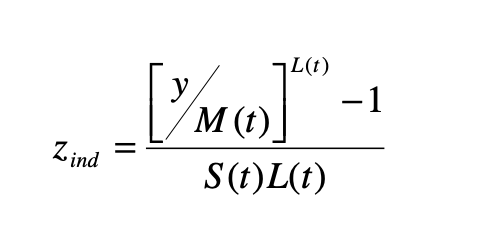

# infant-nutrition-calculator

**Calculator of infants nutrition based on WHO standards.**

## Installation
`npm install infant-nutrition-calculator --save`

## Basic Usage
```
let nutritionCalculator = new (require('infant-nutrition-calculator'))('LANGUAGE')
```
**OR**
```
let infantNutritionCalculator = require('infant-nutrition-calculator')
let nutritionCalculator = new infantNutritionCalculator('LANGUAGE')
```
LANGUAGE is a variable passed to the contructor that can take 3 different values: 'EN' (English), 'FR' (French) or 'ES' (Spanish). Results would be returned in the language selected.
Default language is English

## Basic Usage

```
nutritionCalculator.calculateNutrition(months, gender, weight, height)
```

Where:
- months: A int from 24 to 60. (From 2 years old until 5 years old)
- gender: Either "M" (Male) or "F" (Female)
- weight: The weight of the infant. A number variable that can take any number of decimals.
- height: The height of th infant. A number variable that can take any number of decimals.


## Example response
```
{
  months: 36,
  gender: 'M',
  weight: 14.5,
  height: 96,
  WFA: {
    ID: 'M36',
    Sexo: 'M',
    Meses: '36',
    L: '-0.0689',
    M: '14.3429',
    S: '0.12116',
    zWFA: 0.08987715419006534,
    risk: 'Correcta'
  },
  HFA: {
    ID: 'M36',
    Sexo: 'M',
    Meses: '36',
    L: '1',
    M: '96.0835',
    S: '0.03858',
    zHFA: -0.02252555175172329,
    risk: 'Correcta'
  },
  WFH: {
    ID: 'M96',
    Sexo: 'M',
    'Talla(cm)': '96.0',
    L: '-0.3521',
    M: '14.3037',
    S: '0.08083',
    zWFH: 0.16822650832354302,
    risk: 'Correcta'
  },
  recommendedAction: 'Infant is healthy. No further action needed.'
}
```

## Additional calculations

You can call each of the internal functions separately, in case you are only interested in one of the indicators:

```
nutritionCalculator.calculateWFA(months, gender, weight)
```
```
nutritionCalculator.calculateHFA(months, gender, height)
```
```
nutritionCalculator.calculateWFH(gender, weight, height)
```


## Formulas




- Source: World Health Organization
https://www.who.int/childgrowth/standards/Technical_report.pdf?ua=1

- Z tables:
https://www.who.int/childgrowth/standards/lhfa_girls_2_5_zscores.txt
https://www.who.int/childgrowth/standards/lhfa_boys_2_5_zscores.txt
https://www.who.int/childgrowth/standards/chts_wfa_girls_z/en/
https://www.who.int/childgrowth/standards/chts_wfa_boys_z/en/
https://www.who.int/childgrowth/standards/w_f_l_tables_z_girls/en/
https://www.who.int/childgrowth/standards/w_f_l_tables_z_boys/en/

## Links

- WHO. World Health Organization
https://www.who.int/childgrowth/en/
https://www.who.int/childgrowth/standards/Technical_report.pdf?ua=1
https://www.who.int/childgrowth/standards/velocity/tr3_velocity_report.pdf?ua=1

- Spanish Asociation of Pediatricians:
https://www.aeped.es/sites/default/files/documentos/valoracion_nutricional.pdf
